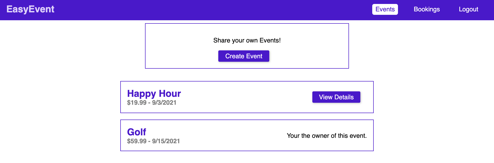

# event-booking

This is an event booking app that uses GraphQL. You are able to create an account and login/logout. A user can create an event and also browse other events. The user can book events.



|                                         |                                         |                                                   |
| :-------------------------------------: | :-------------------------------------: | :-----------------------------------------------: |
|     [Introduction](#event-booking)      | [Table of Contents](#table-of-contents) | [Development Highlights](#development-highlights) |
|      [Installation](#installation)      |    [Page Directory](#page-directory)    |       [Code Hightlights](#code-highlights)        |
| [Technologies Used](#Technologies-Used) |           [Credits](#Credits)           |                [License](#License)                |

## Development Highlights

- Use GraphQL for queries and mutations.

- Created inputs for GraphQL.

- Use jsonwebtoken for login and authentication.

- Use MongoDB to store data.

## Installation

1. Install node modules at root and client.

```
npm i
```

2. Start App at root and client.

```
npm start
```

## Page Directory

The client directory consists of the components and pages directory within source. The components contains children components as folders to organize the parent child relationship.

GraphQL is organized with a resolvers directory and schema directory. The resolvers are based on each model.

## Code Highlights

GraphQL resolver for creating user.

```Javascript
    createUser: async args => {
        try {
            const existingUser = await User.findOne({ email: args.userInput.email });
            if (existingUser) {
                throw new Error('User exists already.');
            }
            const hashedPassword = await bcrypt.hash(args.userInput.password, 12);

            const user = new User({
                email: args.userInput.email,
                password: hashedPassword
            });

            const result = await user.save();

            return { ...result._doc, password: null, _id: result.id };
        } catch (err) {
            throw err;
        }
    },
```

Incorporate reactJS to visualize the data of the bookings.

```JavaScript
const bookingsChart = props => {
    const chartData = { labels: [], datasets: [] };
    let values = [];
    for (const bucket in BOOKINGS_BUCKETS) {
        const filteredBookingsCount = props.bookings.reduce((prev, current) => {
            if (
                current.event.price > BOOKINGS_BUCKETS[bucket].min &&
                current.event.price < BOOKINGS_BUCKETS[bucket].max
            ) {
                return prev + 1;
            } else {
                return prev;
            }
        }, 0);
        values.push(filteredBookingsCount);
        chartData.labels.push(bucket);
        chartData.datasets.push({
            // label: "My First dataset",
            fillColor: 'rgba(220,220,220,0.5)',
            strokeColor: 'rgba(220,220,220,0.8)',
            highlightFill: 'rgba(220,220,220,0.75)',
            highlightStroke: 'rgba(220,220,220,1)',
            data: values
        });
        values = [...values];
        values[values.length - 1] = 0;
    }

    return (
        <div style={{ textAlign: 'center' }}>
            <BarChart data={chartData} />
        </div>
    );
};
```

## Technologies

### Frontend

- [JavaScript](https://www.javascript.com/)
- [CSS](https://www.w3schools.com/css/)

### Frontend Framework/Library

- [ReactJS](https://reactjs.org/)
- [ChartJS](https://www.chartjs.org/)

### Backend

- [Node.js](https://nodejs.org/en/)

### GraphQL

- [graphql](https://graphql.org/)

### Database

- [MongoDB](https://www.mongodb.com/)

## Credits

This project was apart of the [Academind](https://www.youtube.com/playlist?list=PL55RiY5tL51rG1x02Yyj93iypUuHYXcB_)

|                           |                                                                                                                                                                                                       |
| ------------------------- | ----------------------------------------------------------------------------------------------------------------------------------------------------------------------------------------------------- |
| **David Anusontarangkul** | [ LinkedIn](https://www.linkedin.com/in/anusontarangkul/) [ GitHub](https://github.com/anusontarangkul) |

## License

[](https://opensource.org/licenses/MIT)
